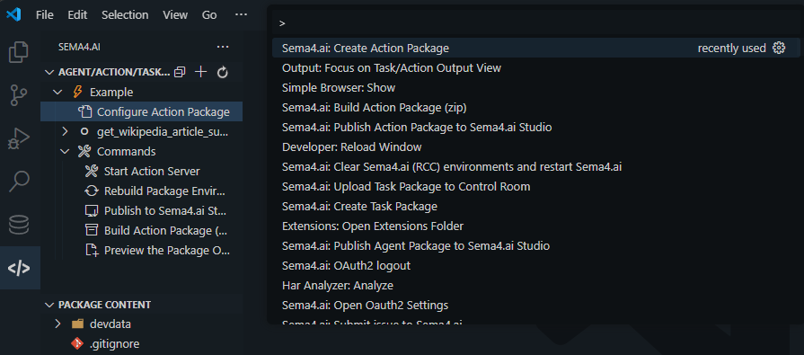

<samp>[Docs](https://robocorp.com/docs) | [Blog](https://medium.com/sema4-ai) | [Examples](https://github.com/sema4ai/cookbook) | [CodeGen](https://chat.robocorp.com) | [Slack](https://sema4ai-users.slack.com/) | [Youtube](https://www.youtube.com/@Robocorp) | [𝕏](https://twitter.com/sema4ai)</samp>

[](https://pypi.org/project/sema4ai-actions)
[](https://pypi.org/project/sema4ai-action-server)
[](https://github.com/sema4ai/actions/issues)
[](https://opensource.org/licenses/Apache-2.0)

> **NOTE:**
> This project started as Robocorp Action Server, and is currently being migrated under Sema4.ai organization. You will still likely find links to Robocorp resources. It's all the same company!

# Build MCP Tools or AI Actions that connect AI Agents with the real-world - all in 🐍 Python.

Sema4.ai is the easiest way to extend the capabilities of AI agents, assistants and copilots with custom actions, written in Python. Create and deploy tools, skills, loaders and plugins that securely connect any AI Assistant platform to your data and applications.

Sema4.ai Action Server makes your Python scripts compatible with Agents using protocols such as [MCP](https://modelcontextprotocol.io/), OpenAI's [custom GPTs](https://chat.openai.com/gpts/editor), [LangChain](https://python.langchain.com/docs/integrations/tools/robocorp/) and [OpenGPTs](https://github.com/langchain-ai/opengpts) by automatically creating and exposing an API based on function declaration, type hints and docstrings. Just create your `@tool` (or `@action`) and start!

<picture>
  <source media="(prefers-color-scheme: dark)" srcset="./docs/include/sema4ai-flow-dark_1x.webp">
  
</picture>

---

<div id="quickstart"></div>

# 🏃‍♂️ Quickstart

There are two main ways using the Action Server: with the command line, or with our VS Code extension. This section gets you going!

<details open>
<summary><b>Install from PyPI</b></summary>

Using an existing Python installation, run:

```sh
pip install sema4ai-action-server
```

After installed the `action-server` executable should be in the `Scripts` or `bin`
(depending on the OS) for the given python installation/environment.

</details>

Alternatively, it's also possible to download the Action Server as a standalone
binary for a specific platform:

<details>
<summary><b>CLI For macOS</b></summary>

```sh
brew update
brew install sema4ai/tools/action-server
```

</details>

<details>
<summary><b>CLI For Windows</b></summary>

```sh
# Download Sema4.ai Action Server
curl -o action-server.exe https://cdn.sema4.ai/action-server/releases/latest/windows64/action-server.exe
```

You can download/move the executable into a folder that is in your `PATH`, or you can [add the folder into PATH](https://www.architectryan.com/2018/03/17/add-to-the-path-on-windows-10/) so that you can call `action-server` wherever you are.

</details>

<details>
<summary><b>CLI For Linux</b></summary>

```sh
# Download Sema4.ai Action Server
curl -o action-server https://cdn.sema4.ai/action-server/releases/latest/linux64/action-server
chmod a+x action-server

# Add to PATH or move to a folder that is in PATH
sudo mv action-server /usr/local/bin/
```

</details>

<details>
<summary><b>Sema4.ai SDK extension for VS Code</b></summary>

After installing [Sema4.ai SDK extension from the VS Code Markeplace](https://marketplace.visualstudio.com/items?itemName=sema4ai.sema4ai), open the Command Palette (`Command-Shift-P` or `Ctrl-Shift-P`) and select `Sema4.ai: Create Action Package`. This will bootstrap a new project. You can then run/debug indvidual Actions from the Extension's sidebar, or start the Action Server.



</details>

<br/>

Bootstrap a new project from a template. You’ll be prompted for the name of the project:

```sh
action-server new
```

Navigate to the freshly created project folder and start the server:

```sh
cd my-project
action-server start
```

👉 You should now have an Action Server running locally at: http://localhost:8080, to open the web UI.

👉 The `MCP` endpoint is available at: `http://localhost:8080/mcp`.

👉 Using the --auto-reload -flag for developing the Action Server will automatically reload your tools/actions when you change them during development.

Head over to [Action Server docs](./action_server/README.md) for more.

---

<div id="python-action"></div>

# What makes a Python function an MCP Tool or ⚡️Action?

1️⃣ `package.yaml` file that describes the `MCP/Action Package` you are working on, and defines up your **Python environment and dependencies**:

```yaml
spec-version: v2

name: Package name
description: Package description
documentation: https://github.com/...

dependencies:
  conda-forge:
    - python=3.12.10
    - uv=0.6.11
  pypi:
    - sema4ai-actions=1.3.15
    - sema4ai-mcp=0.0.1
    - pytz=2024.1

pythonpath:
  - src
  - tests

dev-dependencies:
  pypi:
    - pytest=8.3.3

dev-tasks:
  test: pytest tests

packaging:
  exclude:
    - ./.git/**
    - ./.vscode/**
    - ./devdata/**
    - ./output/**
    - ./venv/**
    - ./.venv/**
    - ./.DS_store/**
    - ./**/*.pyc
    - ./**/*.zip
    - ./**/.env
    - ./**/__MACOSX
    - ./**/__pycache__
    - ./**/.git
    - ./node_modules/**
```

<details>
  <summary>🙋‍♂️ "Why not just pip install...?"</summary>

Think of this as an equivalent of the requirements.txt, but much better. 👩‍💻 With `package.yaml` you are not just controlling your PyPI dependencies, you control the complete Python environment, which makes things repeatable and easy.

👉 You will probably not want run the Actions just on your machine, so by using `package.yaml`:

- You can avoid `Works on my machine` -cases
- You do not need to manage Python installations on all the machines
- You can control exactly which version of Python your automation will run on
  - ..as well as the pip or uv version to avoid dependency resolution changes
- No need for venv, pyenv, ... tooling and knowledge sharing inside your team.
- Define dependencies in `package.yaml` and let our tooling do the heavy lifting.
- You get all the content of [conda-forge](https://prefix.dev/channels/conda-forge) without any extra tooling

> The environment management is provided by [RCC](https://github.com/joshyorko/rcc) - a community fork that uses official conda-forge sources instead of proprietary CDNs.

</details>
<br/>

2️⃣ [@tool decorator](./mcp) or [@action decorator](./action) that determines the **tool or action entry point** and [Type hints and docstring](./actions#describe-your-action) to let AI agents know **what the Tool/Action does** in natural language

Note: any function decorated as `@action` imported from `sema4ai.actions` is also available as a `@tool` imported from `sema4ai.mcp` and vice-versa (besides, there are other custom decorators for other functionalities such as `@resource`, `@prompt` for mcp and `@query` for actions).

```py
from sema4ai.mcp import tool

@tool
def greeting(name: str) -> str:
    """
    Greets the user

    Args:
        name (str): The user name

    Returns:
        str: Final user greeting
    """
```

---

<div id="connect-mcp-client"></div>
## Connect using an MCP client

Once you have started the Action Server, point the client to the **Action Server** `/mcp` endpoint
(example: `http://localhost:8080/mcp`).

Note: in production, the `Action Server` should be put under a reverse proxy that controls SSL and authentication.

<div id="connect-gpt"></div>
## Connect with OpenAI GPTs Actions

For testing with a GPTs actions, it's possible to start the `Action Server` with the `--expose` flag.

Once you have started the Action Server with `--expose` flag, you’ll get a URL available to the public, along with the authentication token. The relevant part of the output from the terminal looks like this, of course with your own details:

```sh
...
Uvicorn running on http://localhost:8080 (Press CTRL+C to quit)
🌍 URL: https://seventy-six-helpless-dragonflies.sema4ai.link
🔑 Add following header api authorization header to run actions: { "Authorization": "Bearer xxx_xxx" }
```

<h3 id="actions-video" align="center">
  <a href="https://www.youtube.com/watch?v=7aq6QDCaUmA">
    👉 Example video in Youtube 👈
  </a>
</h3>

Adding the Action Server-hosted AI Action to your custom GPT is super simple: basically just navigate to “Actions” section of the GPT configuration, add the link to import the actions, and **Add Authentication** with **Authentication method** set to _“API key”_ and **Auth Type** to _“Bearer”_.

> **TIP:**
> Use the `@action(is_consequential=False)` flag to avoid the user needing to accept the action execution separately each time on your GPT.

<div id="why-actions"></div>

## Why use Sema4.ai AI Actions

- ❤️ “when it comes to automation, the (ex)Robocorp suite is the best one” _[/u/disturbing_nickname](https://old.reddit.com/r/rpa/comments/18qqspn/codeonly_rpa_pet_project/kez2jds/?context=3)_
- ❤️ “(ex)Robocorp seems to be a good player in this domain” _[/u/thankred](https://old.reddit.com/r/rpa/comments/18r5gne/recommendation_for_open_source_or_somewhat_less/kez6aw6/?context=3)_
- ❤️ “Since you know Python, check out (ex)Robocorp. Their product is crazy good.” _[/u/Uomis](https://old.reddit.com/r/rpa/comments/18n5sah/c/ke8qz2g?context=3)_

Sema4.ai stack is hands down the easiest way to give AI agents more capabilities. It’s an end-to-end stack supporting every type of connection between AI and your apps and data. You are in control where to run the code and everything is built for easiness, security, and scalability.

- 🔐 **Decouple AI and Actions that touches your data/apps** - Clarity and security with segregation of duties between your AI agent and code that touches your data and apps. Build `@tool` or `@action` and use from multiple AI frameworks.
- 🏎️ **Develop Actions faster with Sema4.ai's `robocorp` automation libraries** - [Robocorp libraries](https://github.com/robocorp/robocorp) and the Python ecosystem lets you act on anything - from data to API to Browser to Desktops.
- 🕵️ **Observability out of the box** - Log and trace every `@tool` or `@action` run automatically without a single `print` statement. _Pro tip: connect [LangSmith](https://www.langchain.com/langsmith) traces with Action logs!_
- 🤯 **No-pain Python environment management** - Don't do [this](https://xkcd.com/1987/). Sema4.ai manages a full Python environment for your actions with ease.
- 🚀 **Deploy with zero config and infra** - One step deployment, and you'll be connecting your `@tool` to MCP clients or `@action` to AI apps like Langchain and OpenAI GPTs in seconds.

<div id="inspiration"></div>

## Inspiration

Check out these example projects for inspiration.

- 🐣 [Simplest possible AI Action](https://github.com/Sema4AI/cookbook/tree/master/actions/simple-greeter)
- 🤡 [Get a random joke or jokes per theme. Showcases how easy it is to work with APIs.](https://github.com/Sema4AI/cookbook/tree/master/actions/api-jokes)
- 📝 [Add files to agent conversation](https://github.com/Sema4AI/cookbook/tree/master/actions/chat-files)

Build more `@actions` and be awesome! We'd love to hear and see what have you built. Join our [Slack community](https://sema4ai-users.slack.com/) to share your work.

<div id="community-edition"></div>

## 🌍 Community Edition

This build uses the **[joshyorko/rcc](https://github.com/joshyorko/rcc)** fork (v18.13.1) - a fully open-source version of RCC with several key benefits:

### Why the Community RCC Fork?

| Feature | Original RCC | Community Fork |
|---------|-------------|----------------|
| **Micromamba Source** | Robocorp CDN | Official conda-forge (micro.mamba.pm) |
| **Infrastructure Dependencies** | Robocorp cloud services | None - fully decoupled |
| **Telemetry** | Robocorp telemetry | Minimal/disabled |
| **Startup Speed** | Standard | Faster (fewer network calls) |
| **Go Version** | Varies | 1.23 (latest security patches) |

### Performance Benefits

The community fork is often noticeably faster because:
- **No proprietary network handshakes** - skips Robocorp/Sema4ai cloud checks
- **Direct conda-forge access** - downloads from official sources, no CDN redirects
- **Leaner initialization** - removed Robocorp-specific requirements
- **Efficient holotree caching** - environments are cached locally and reused

Once an environment is bootstrapped, subsequent startups are near-instant as the holotree cache is reused.

### Environment Caching

The Action Server caches Python environments based on your `package.yaml` hash:
- **Cache location**: `~/.sema4ai/action-server/{datadir}/env-info/{hash}.json`
- **Holotree location**: `~/.robocorp/holotree/`
- **Invalidation**: Automatic when `package.yaml` changes or Python executable is deleted

To clear caches: `action-server env clean-tools-caches`

---

<div id="building"></div>

## 🔨 Building from Source

**Good news!** The Action Server can be built from source without any private credentials. The frontend design system packages are vendored directly in the repository.

### Prerequisites

- **Node.js**: LTS 20.x (20.9.0 or later)
- **npm**: 10.x or later (bundled with Node.js)
- **Python**: 3.11+ (for the Action Server backend)

### Build the Frontend

```sh
# Navigate to frontend directory
cd action_server/frontend

# Install dependencies (no authentication required!)
npm ci

# Build the frontend
npm run build
```

The build output will be in `action_server/frontend/dist/`.

### Why No Credentials Needed?

The frontend uses three private design system packages (`@sema4ai/components`, `@sema4ai/icons`, `@sema4ai/theme`) that are normally hosted in a private GitHub Packages registry. These packages are **vendored** (copied) directly into the repository at `action_server/frontend/vendored/`, making them available to all contributors.

This approach enables:
- ✅ External contributors can build without credentials
- ✅ Offline builds work after initial clone
- ✅ Reproducible builds with exact package versions
- ✅ Air-gapped environments are supported

For more details, see the [vendored packages documentation](action_server/frontend/vendored/README.md).

<div id="contribute"></div>

## Contributing and issues

> ⭐️ First, please star the repo - your support is highly appreciated!

- 🚩 Issues – our [GitHub Issues](https://github.com/Sema4AI/actions/issues) is kept up to date with bugs, improvements, and feature requests
- 🙋 Help - you are welcome to [join our Community Slack](https://sema4ai-users.slack.com/) if you experience any difficulty getting setup
- 🌟 Contribution and recognition – Start [here](https://github.com/Sema4AI/actions/blob/master/CONTRIBUTING.md), [PR's](https://github.com/Sema4AI/actions/pulls) are welcome!
- 🔐 Refer to our [Security policy](https://sema4.ai/.well-known/security.txt) for details

### Contributors


