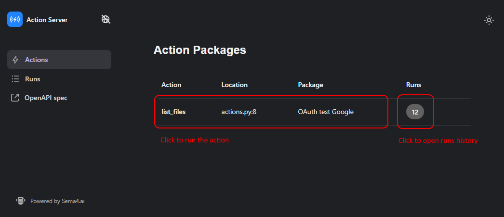
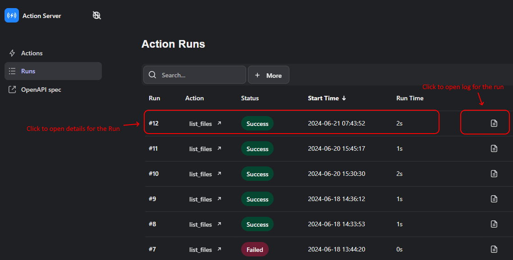

# Action Server UI

The Action Server provides a builtin UI which can help while developing actions.

## Disclaimer

In general, for deployment it's not expected that the Action Server
nor its UI are exposed directly, rather some kind of reverse proxy should be put
in front of it which would filter the traffic so that private parts of its REST API
are not exposed and https is done (while the Action Server does have support for
https, it lacks a way for clients to update the certificates without actually
restarting the server).

Note: when `action-server start --expose` is done it takes care of the details
noted above, but there's no real user or access management done.

## Purpose

The main purpose of the Action Server UI is for helping developers develop and
test actions or for internal users to query and analyze what was actually executed
in the Action Server.

Initial UI for the Action Server, shows actions loaded in the Action Server.

## Running an Action

To run an action, after clicking the action you want to run a panel will
open showing the data that needs to be filled to run the action.

The example above shows a case where `OAuth2` is required for `Slack` and `Google`
to run the action along with a `count` parameter.

## Configuring OAuth2

In this case, a developer must create an application in the proper service
(say, `google` and `slack`), fill in the details in the `OAuth2 Settings YAML`
and then do the proper `login` in the service in the `Run Action UI` to run the action.

See: 

## Runs

Whenever an action is run, the `Action Runs` view will receive a new entry. From this
view it's possible to see more details on a given run as well as opening the full
Python logging execution.

## Action log.html

A `log.html` is automatically collected for any action run and it shows full tracing
information on the action run and may be used to diagnose problems running an action
from the Action Server -- see: [Generated Logs and Artifacts](./10-generated-logs-and-artifacts.md)
for more information on how to configure it.

