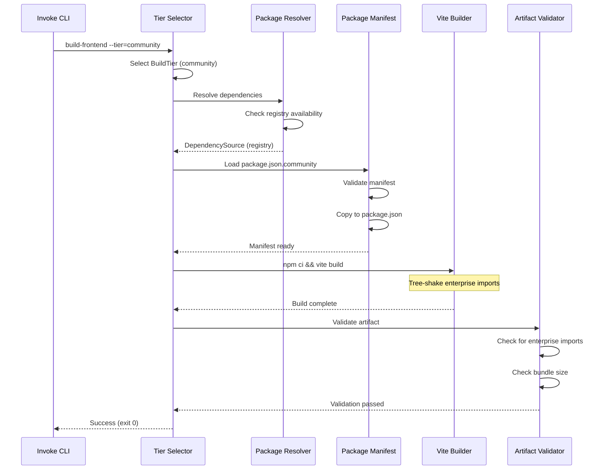
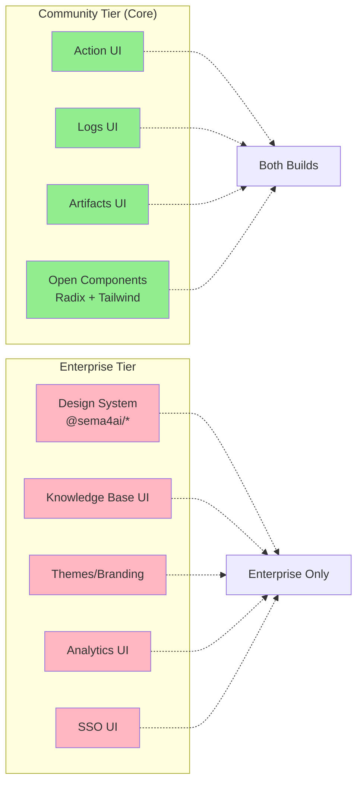

# Build System Architecture

## Overview

This document describes the dual-tier build system architecture for the Action Server frontend. The system enables external contributors to build and customize the frontend using only open-source components, while internal developers retain seamless access to proprietary design system packages.

## Directory Structure

```mermaid
flowchart TD
    A[action_server/frontend/src/] --> B[core/]
    A --> C[enterprise/]
    A --> D[shared/]
    
    B --> B1[components/ui/]
    B --> B2[pages/]
    B --> B3[services/]
    
    C --> C1[components/]
    C --> C2[pages/]
    C --> C3[services/]
    
    B1 -.->|Radix UI + Tailwind| E[Community Builds]
    C1 -.->|@sema4ai packages| F[Enterprise Builds]
    
    style B fill:#90EE90
    style C fill:#FFB6C1
    style D fill:#87CEEB
```

**Core Directory** (`src/core/`):
- Contains community-tier features available in all builds
- Uses Radix UI + Tailwind CSS for UI components
- Example files:
  - `core/components/ui/Button.tsx`
  - `core/pages/Actions.tsx`
  - `core/services/api-client.ts`

**Enterprise Directory** (`src/enterprise/`):
- Contains enterprise-tier features (paid/proprietary)
- Uses @sema4ai design system packages
- Tree-shaken out of community builds
- Example files:
  - `enterprise/components/DesignSystemButton.tsx`
  - `enterprise/pages/KnowledgeBase.tsx`
  - `enterprise/services/analytics-client.ts`

**Shared Directory** (`src/shared/`):
- Tier-agnostic utilities and types
- Used by both community and enterprise code
- Example files:
  - `shared/types.ts`
  - `shared/utils/format.ts`

## Build Flow



**Build Steps**:
1. **Tier Selection**: CLI flag or env var determines community vs enterprise
2. **Dependency Resolution**: Check registry → vendored → CDN (enterprise only)
3. **Manifest Loading**: Load tier-specific `package.json.{tier}` and validate
4. **Package Installation**: Run `npm ci` to install dependencies
5. **Build**: Run Vite with tier-specific tree-shaking configuration
6. **Validation**: Check for import violations, size budget, determinism
7. **SBOM Generation**: Create CycloneDX bill of materials

## CI Matrix Strategy

```mermaid
graph TB
    subgraph "CI Workflow: frontend-build.yml"
        Matrix[Matrix Strategy<br/>tier × os]
        
        Matrix --> CU[Community × Ubuntu]
        Matrix --> CM[Community × macOS]
        Matrix --> CW[Community × Windows]
        Matrix --> EU[Enterprise × Ubuntu]
        Matrix --> EM[Enterprise × macOS]
        Matrix --> EW[Enterprise × Windows]
        
        CU --> C1[No secrets<br/>Public registry only]
        CM --> C1
        CW --> C1
        
        EU --> E1[NPM_TOKEN scoped<br/>Private registry access]
        EM --> E1
        EW --> E1
        
        C1 --> V1[Import guard<br/>Size check<br/>Determinism]
        E1 --> V2[Size check<br/>Determinism]
        
        V1 --> A1[Upload artifact<br/>frontend-community-{os}]
        V2 --> A2[Upload artifact<br/>frontend-enterprise-{os}]
    end
    
    subgraph "Fork PR Handling"
        PR[External PR<br/>from fork]
        PR --> Skip[Skip enterprise jobs]
        PR --> Run[Run community jobs]
    end
    
    style CU fill:#90EE90
    style CM fill:#90EE90
    style CW fill:#90EE90
    style EU fill:#FFB6C1
    style EM fill:#FFB6C1
    style EW fill:#FFB6C1
```

**Matrix Configuration**:
```yaml
strategy:
  matrix:
    tier: [community, enterprise]
    os: [ubuntu-latest, macos-latest, windows-latest]
  fail-fast: false  # Continue on failure per NFR-012
```

**Secrets Scoping**:
- **Community jobs**: No secrets, blocked from private registries
- **Enterprise jobs**: `NPM_TOKEN` conditionally scoped with `matrix.tier == 'enterprise'`
- **Fork PRs**: Enterprise jobs skipped entirely (`github.event.pull_request.head.repo.fork == true`)

**Failure Attribution** (NFR-011):
- Each matrix job logs tier, OS, step name, error category
- Exit codes: 0=success, 1=build error, 2=validation error, 3=config error, 4=dependency error
- Job summary includes actionable remediation messages

**Success Rate Monitoring** (NFR-010):
- Track community tier success rate: `(passed_jobs / total_jobs) * 100%`
- Displayed in job summary for visibility

## Feature Boundaries

Reference: FR-017 canonical feature list



**Feature Mapping**:
- **Core Features** (Community + Enterprise):
  - Action execution interface
  - Run history and logs
  - Artifact browsing
  - Radix UI components
  
- **Enterprise Features** (Enterprise only):
  - Proprietary design system
  - Knowledge Base UI
  - Advanced analytics
  - SSO/SAML configuration
  - Custom themes/branding

## Tier Selection Mechanism

**Precedence**: CLI flag > Environment variable > Default (community)

```python
# Example: Tier selection in Python
from action_server.build_binary.tier_selector import select_tier

# CLI flag takes precedence
tier = select_tier(cli_flag="enterprise", env_var="community")
# Result: ENTERPRISE

# Env var if no CLI flag
tier = select_tier(cli_flag=None, env_var="enterprise")
# Result: ENTERPRISE

# Default to community
tier = select_tier(cli_flag=None, env_var=None)
# Result: COMMUNITY
```

**Invoke CLI**:
```bash
# Default: community tier
inv build-frontend

# Explicit tier via flag
inv build-frontend --tier=enterprise

# Via environment variable
TIER=enterprise inv build-frontend

# Convenience aliases
inv build-frontend-community
inv build-frontend-enterprise
```

## Dependency Resolution Fallback Order

**Community Tier**:
1. Public npm registry (registry.npmjs.org)
2. ❌ No fallback (error if registry unavailable)

**Enterprise Tier**:
1. Private registry (npm.pkg.github.com) - requires NPM_TOKEN
2. Vendored packages (action_server/frontend/vendored/) - offline fallback
3. CDN (cdn.sema4ai.com) - manual workflow only, not for release artifacts

**Availability Check**:
- Registry: 5-second timeout on `npm ping`
- Vendored: Check for `manifest.json` existence
- CDN: Socket connection to hostname on port 443

**Error Handling**:
- Registry unavailable → Warning + fallback to vendored
- NPM_TOKEN expired → Error with remediation: "Run `npm login --registry=...`"
- All sources failed → DependencyError with exit code 4

## Implementation Phases

This architecture supports phased implementation:

**Phase 3.1**: Setup & Project Structure ✅ (Current)
- Directory structure created
- Package manifests defined
- Build system modules scaffolded

**Phase 3.2**: Tests First (TDD) ⏳ (Next)
- Unit tests for tier selector, package resolver, tree shaker
- Contract tests for CLI and validation
- Integration tests for end-to-end scenarios

**Phase 3.3**: Core Implementation
- Implement build task (`inv build-frontend`)
- Update Vite config with tree-shaking
- Integrate validation pipeline

**Phase 3.4**: Integration & Polish
- Quickstart scenario validation
- Documentation updates
- Performance validation

## References

- **Feature Specification**: `specs/003-open-core-build/spec.md`
- **Implementation Plan**: `specs/003-open-core-build/plan.md`
- **Task Breakdown**: `specs/003-open-core-build/tasks.md`
- **Data Model**: `specs/003-open-core-build/data-model.md`
- **Build System README**: `action_server/frontend/README.md`
