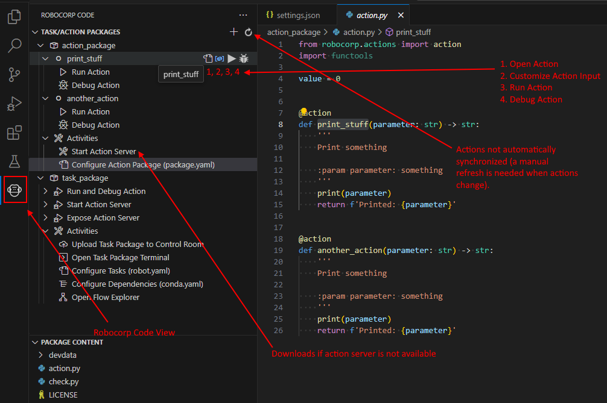

# Action Templates

AI Action templates for developers to get started with [Sema4.ai Action Server](https://github.com/sema4ai/actions/tree/master/action_server/docs#readme).

`Actions` and `Action Server` enable you to "give your AI Agents hands" meaning that your AI/LLM Agent can help your users perform distinct actions that get executed based on the LLM discussion.

## Quickstart

👉 Follow the Action Server [Quickstart guide](https://github.com/sema4ai/actions?tab=readme-ov-file#%EF%B8%8F-quickstart). 

## Dependency management

Dependencies need to be added to [`package.yaml`](package.yaml).

👉 [package.yaml documentation](https://github.com/sema4ai/actions/blob/master/action_server/docs/guides/01-package-yaml.md)

## Actions in VS Code 

👉 Using [Robocorp Code extension for VS Code](https://marketplace.visualstudio.com/items?itemName=robocorp.robocorp-code), you can get everything set up and running in VS Code in no time.

The template has a few files that enable the extension to find and set up your action environment and provide code completion. There is also a side panel where we have and will add some easy-to-use functionalities.

When debugging your Actions Python code, you probably do not want to give the inputs every time you run and always be running the Action Server. `Robocorp Code` integration allows you to run and debug actions from within VSCode, enabling custom input to be specified as `.json` files.